  # 1.2 Combining Managed Modules into Assemblies — Expanded + Modernized Author Edition

## ⭐ Assemblies: The Real Unit of Execution in .NET

Although compilers produce modules (IL + metadata), the CLR’s binding and identity unit is the assembly. At runtime, the CLR resolves types using assembly identity, while the actual code and metadata still live in one or more loaded modules (including the manifest module).
An **assembly** is more than just a file. It is a logical container, a self-describing unit that defines:
* What code it contains
* What resources it owns
* What external components it requires
* Under what name, version, culture, and (optionally) signing/integrity characteristics it should be identified and bound

> **Key Takeaway:** When you think of a “component” in .NET, you are really thinking of an **assembly**.

## ⭐ Logical vs Physical Assemblies

This is a point that many developers misunderstand when starting with .NET:

### 🧩 Visualizing the Process

```mermaid
flowchart LR
    subgraph Inputs ["Inputs"]
        SC["Source Code (.cs/.vb)"]
        RES["Resources (.png, .json)"]
    end

    subgraph Tool ["Compilation & Linking"]
        C1["Compiler (Roslyn) / MSBuild"]
    end

    subgraph Output ["Final Assembly (Logical Unit)"]
        direction TB
        MAN["📂 MANIFEST (The Brain)"]
        IL["📄 IL Code"]
        META["📊 Metadata"]
        R_OUT["🖼️ Resources"]
    end

    SC --> C1
    RES --> C1
    C1 --> Output
    
    style MAN fill:#f9f,stroke:#333,stroke-width:2px,color:black
    style Output fill:#e1f5fe,stroke:#333,stroke-width:2px,color:black
```



> **A module is a physical file.**
> **An assembly is a logical identity.**

You may physically have:
* **One .dll file** → 1 assembly (Standard)
* ** One manifest .dll/.exe + one or more separate .netmodule files → 1 logical assembly (Legacy/Rare)
* ** A single-file published app can bundle many assemblies into one physical file; they remain logically separate assemblies, and the runtime loads them from the bundle (sometimes extracting, depending on publish settings).
* **A NativeAOT app ships primarily as native code rather than IL; the assembly concept still exists at build/publish time, but reflection and dynamic loading behaviors may be reduced depending on trimming/AOT constraints.

This clear separation allows .NET to scale into scenarios the original CLR design never anticipated.

## ⭐ How Multiple Files Become One Assembly

Historically, tools like `AL.exe` (Assembly Linker) combined modules and resources into one final assembly.

The conceptual formula is:
```text
Modules (IL + metadata)
   + Resources (images, data, etc.)
   + Manifest data
= Assembly
```

The **Manifest** becomes the key. It is "metadata about the metadata" — describing every file, type, and version inside the assembly.

Today, most developers don’t invoke `AL.exe` directly. The **.NET SDK**, **MSBuild**, and **Roslyn** hide all of this complexity and produce assemblies automatically.

## ⭐ The Assembly Manifest — The Brain of an Assembly

The manifest stores crucial metadata:
* 📄 The list of files in the assembly
* 🆔 The assembly’s identity (name, version, culture, public key token)
* 🔗 Referenced assemblies and their versions
* 📤 Exported types
* 🔐 Hashing and integrity information
* 🗺️ Resource mapping

**In modern .NET, the manifest is also used by:**
* The linker and trimmer
* Single-file bundling
* ReadyToRun code generation
* NativeAOT compilation
* `AssemblyLoadContext` isolation

It is the mechanism that keeps .NET deployment consistent and self-contained — no registry, no COM registration, no “DLL Hell.”

## ⭐ Why .NET Needs Assemblies (Even in 2025)

Even though **.NET 8/9** can generate native executables, can bundle everything into a single file, and can strip unused IL, assemblies still matter because they are the unit of:

* **Versioning**
* **Code visibility** (internal vs public)
* **Dependency tracking**
* **Load-time binding**
* **Reflection**
* **Runtime contract enforcement**

The CLR always asks:
1. *“Which assembly defines this type?”*
2. *“Is the version compatible?”*
3. *“Where is the manifest information?”*

Even if the physical representation changes, this logical concept remains essential.

## ⭐ Assemblies Improve Deployment

One of the most painful drawbacks of classic Windows programming was COM registration and system-wide dependency installation. Assemblies solved this by making every component **self-describing**.

**The result?**
* ✅ **XCOPY deployment** (Just copy files and run)
* ✅ **No Registry entries** required
* ✅ **No global path pollution**
* ✅ **No COM/ActiveX dependencies**
* ✅ **No GAC conflicts** (in .NET Core+ the GAC is gone)

An assembly records references to other assemblies, but in modern .NET the full dependency graph and binding decisions are also driven by deployment metadata (notably .deps.json) and the hosting/binding policy. This is why deployment in modern .NET is radically simpler than in .NET Framework or COM.

### On-demand and modular deployment

Assemblies also enable a deployment model that is difficult or impossible with native components:
the ability to partition rarely used features into separate files while still treating them as part of the
same logical component. In practice, optional features are most commonly shipped as separate assemblies/plugins (often loaded via AssemblyLoadContext) or as satellite resource assemblies (e.g., *.resources.dll). These remain separate assemblies with their own manifests, but can still be versioned and loaded consistently as part of the application’s overall dependency set.

This model is particularly valuable for applications that ship large optional subsystems—help
systems, images, localization resources, plug-ins, diagnostic modules, or domain-specific extension
packs. Instead of forcing all users to download or install these components, the application may place
them into auxiliary files that are retrieved on demand or included only in specific distribution bundles.
If a user never invokes the associated feature, the corresponding files are never loaded into memory
or even downloaded, reducing installation size, minimizing I/O overhead, and improving startup time.

Despite the physical separation, all files remain bound together through the assembly’s manifest.
The manifest defines a unified identity, version, and security boundary for the entire logical assembly,
ensuring that late-loaded modules are still validated, version-checked, and bound consistently with the
application’s original dependency graph. The CLR treats all constituent files—whether loaded eagerly
or lazily—as a single, coherent component with well-defined visibility rules and versioning semantics.

In modern .NET (Core, 5–9), this design works seamlessly with advanced deployment models such
as single-file publishing, ReadyToRun images, trimming, and NativeAOT. Even when the physical
structure of a deployed application changes—merged into one file, optimized to native code, or split
across multiple bundles—the logical assembly identity described by the manifest remains intact. This
preserves compatibility with reflection, security policies, and assembly binding rules, while still giving
developers the flexibility to modularize and optimize deployment in ways that were not possible in
the early CLR era.

